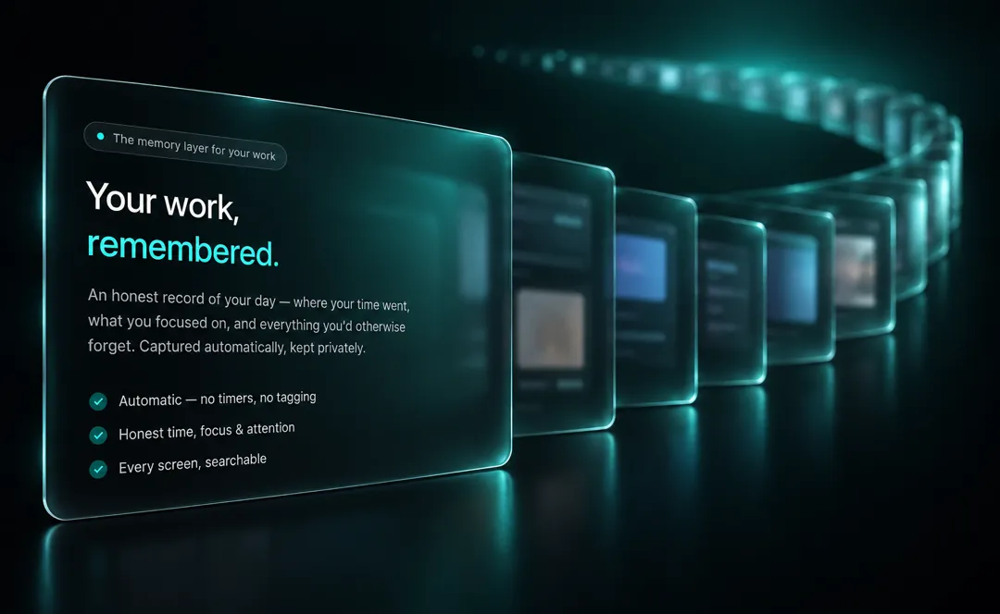
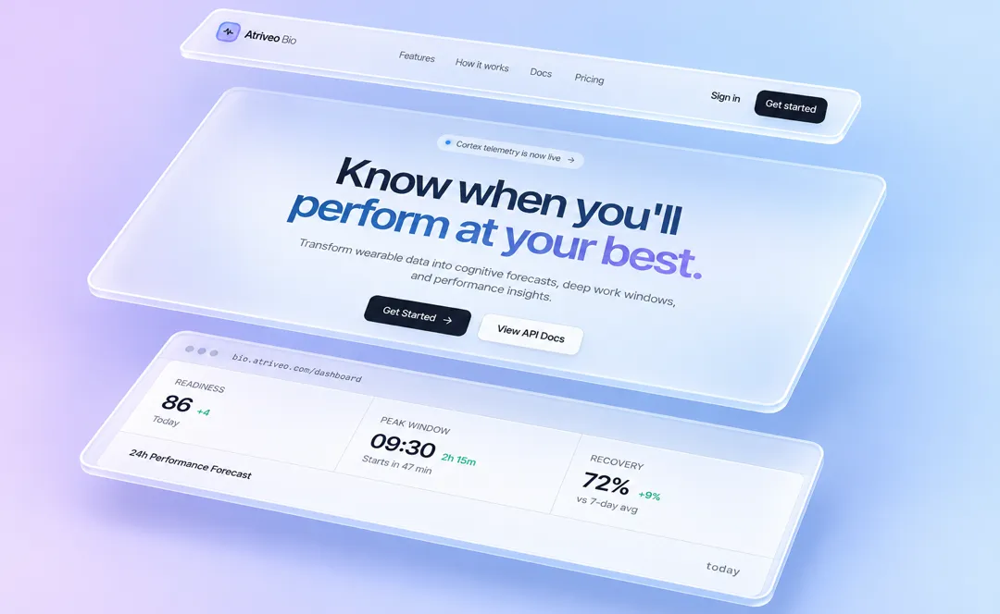
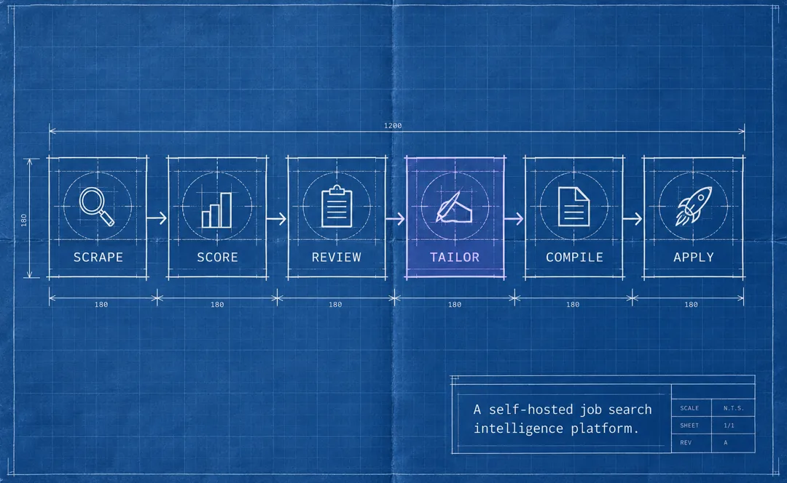
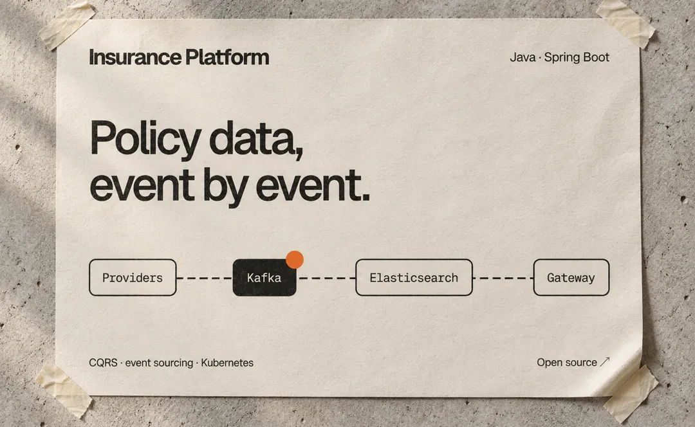

  

<h1 align="center">Atishay Kasliwal</h1>

  Software &amp; AI Engineer · New York 
  Building distributed systems, applied AI products, and the interfaces on top of them.

  <a href="https://atishaykasliwal.com">Portfolio</a> ·
  <a href="https://www.atriveo.com">Atriveo</a> ·
  <a href="https://www.linkedin.com/in/atishay-kasliwal">LinkedIn</a> ·
  <a href="mailto:katishay@gmail.com">Email</a> ·
  <a href="https://atishaykasliwal.com/Atishay-Kasliwal-Resume.pdf">Résumé</a>

---

I like systems that do something useful with messy information: remember a workday, explain a readiness score, follow a job application, or find a signal in a Federal Reserve statement. I work from data model and infrastructure through the final interface, with a bias toward measurable behavior and software that can be operated after launch.

Right now I am building **[Atriveo](https://www.atriveo.com)**, a set of focused products for job search, working memory, and personal performance. I hold an **M.S. in Data Science from Stony Brook University (2026)** and previously built production software at **Bounteous**, **Wake Forest CAIR**, and **Stony Brook University**.

## Away from the screen

I keep coming back to **photography**. The older version of my site had a 42-image gallery, and I want to bring a smaller, better-edited version of it back. With a camera in hand, I notice things I would normally walk past, like light across a building or a pattern in the street. Sometimes it is a quiet moment between people. That habit has sharpened my eye for spacing and composition when I design interfaces.

## Selected work

<table>
  <tr>
    <td width="50%" valign="top">
      
      <h3><a href="https://tracker.atriveo.com">Atriveo Tracker</a></h3>
      
A Chrome extension and dashboard that captures job applications from 60 job sites, then tracks referrals, assessments, notes, and follow-ups.

      
<code>React</code> <code>Hono</code> <code>Postgres</code> <code>Cloudflare</code> · <a href="https://github.com/atishay-kasliwal/Atriveo">Code</a>

    </td>
    <td width="50%" valign="top">
      
      <h3><a href="https://cortex.atriveo.com/login">Atriveo Cortex</a></h3>
      
A local-first working-memory layer that turns screen and audio history into sessions, projects, commitments, and open loops.

      
<code>TypeScript</code> <code>Hono</code> <code>ScreenPipe</code> <code>Ollama</code> · <a href="https://github.com/atishay-kasliwal/atriveo-cortex">Code</a>

    </td>
  </tr>
  <tr>
    <td width="50%" valign="top">
      
      <h3><a href="https://bio.atriveo.com">Atriveo Bio</a></h3>
      
A wearable intelligence API that turns Apple Health data into an explainable readiness score, personal baselines, and deep-work forecasts.

      
<code>TypeScript</code> <code>Postgres</code> <code>SwiftUI</code> <code>XGBoost</code> · <a href="https://github.com/atishay-kasliwal/cortex-bio">Code</a>

    </td>
    <td width="50%" valign="top">
      
      <h3><a href="https://application.atriveo.com">Atriveo Job Search</a></h3>
      
A self-hosted pipeline that finds roles, scores fit, and uses a local model to tailor one-page résumés from verified experience.

      
<code>Python</code> <code>TypeScript</code> <code>Local LLM</code> · <a href="https://github.com/atishay-kasliwal/Atriveo-JD-Extractor">Code</a>

    </td>
  </tr>
  <tr>
    <td width="50%" valign="top">
      
      <h3><a href="https://github.com/atishay-kasliwal/insurance-microservices-platform">Insurance Platform</a></h3>
      
An event-driven insurance platform built around CQRS, event sourcing, Kafka, Elasticsearch, and independently deployable services.

      
<code>Java</code> <code>Spring Boot</code> <code>Kafka</code> <code>Kubernetes</code>

    </td>
    <td width="50%" valign="top">
      
      <h3><a href="https://github.com/atishay-kasliwal/fedtalk-openai-analysis-main">FedTalk</a></h3>
      
Research on whether an LLM can anticipate short-horizon market reactions to FOMC statements using transcripts, retrieved news, and minute-level prices.

      
<code>Python</code> <code>GPT-4o</code> <code>Whisper</code> <code>Pinecone</code>

    </td>
  </tr>
</table>

## More open source

- **[Atriveo Reel](https://github.com/atishay-kasliwal/atriveo-reel)** turns two source clips into a vertical comparison video. The Next.js app queues durable render jobs, while FFmpeg handles the video and Remotion handles text.
- **[Kaggriculture](https://github.com/atishay-kasliwal/kaggriculture)** is my game-agent research desk for a competitive farming economy, with deterministic simulation, planner search, opponent models, replay analysis, and experiment tracking.
- **[Bayesian Marketing Mix](https://github.com/atishay-kasliwal/bayesian-marketing-mix-model)** measures channel impact across 156 weeks, then tests budget changes with holdout validation and 1,000-run uncertainty simulations.
- **[InsureRaft](https://github.com/atishay-kasliwal/InsureRaft)** is a C++ insurance event log built on NuRaft, with quorum writes, idempotent commands, snapshots, and automatic leader election.

## Work

- **Software Engineer, Research · Stony Brook University** — event-driven research infrastructure, production AI services, retrieval pipelines, and real-time analytical interfaces.
- **Artificial Intelligence Engineer · Wake Forest CAIR** — cloud model serving and medical-imaging pipelines across more than 50,000 scans and 10 TB of data.
- **Senior Software Engineer · Bounteous** — 20+ production microservices across fintech, telecom, and commerce, supporting more than 100,000 monthly users.
- **Software Engineer Intern · Shriffle** — billing services and operations dashboards handling more than 10,000 daily transactions.

## Toolkit

| | |
| --- | --- |
| **Languages** | TypeScript, Python, Java, Go, SQL, C++ |
| **Product** | React, Hono, FastAPI, Spring Boot, SwiftUI, REST, GraphQL |
| **AI & data** | PyTorch, LangChain, Pinecone, PostgreSQL, MongoDB, Kafka, Airflow |
| **Infrastructure** | AWS, GCP, Cloudflare, Docker, Kubernetes, Terraform, CI/CD |

## What I optimize for

- **Evidence over theatre.** Claims should resolve to a working product, a repository, or a measured result.
- **Privacy by architecture.** Personal data stays local when the product permits it; published views expose only what they need.
- **Boring reliability.** Idempotency, migrations, observability, explicit failure modes, and small operational surfaces.
- **Interfaces that explain the system.** The user should be able to understand why the software reached an answer.

  Open to full-time software engineering and AI/ML roles in the United States. 
  <a href="mailto:katishay@gmail.com">katishay@gmail.com</a>

